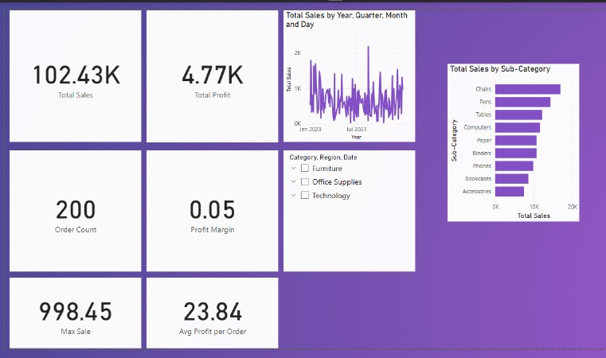

# Sales Insights Dashboard using Power BI and DAX

This project is a fully interactive Power BI dashboard built using a sample sales dataset. It showcases key business metrics such as Total Sales, Profit, Profit Margin, Order Volume, and Category Performance, using DAX measures for calculations and analysis.

---

## Features

- Built entirely in Power BI Desktop
- Uses custom DAX measures for all KPIs
- Clean and minimal visual design
- Slicers for Region, Category, and Date
- Multiple charts including line chart, bar chart, and card visuals

---

## Dataset

The dataset contains:
- Order ID
- Date
- Region
- Category and Sub-Category
- Sales
- Quantity
- Profit

Saved as `sample_sales_dataset.csv` and loaded into Power BI.

---

## DAX Measures Used

- Total Sales = SUM(Sales)
- Total Profit = SUM(Profit)
- Profit Margin = DIVIDE([Total Profit], [Total Sales])
- Max Sale = MAX(Sales)
- Avg Profit per Order = AVERAGE(Profit)
- Order Count = COUNT(OrderID)
- Sales YOY = CALCULATE([Total Sales], FILTER(ALL('sample_sales_dataset'), YEAR('sample_sales_dataset'[Date]) = YEAR(TODAY()) - 1))

---

## Visuals in the Dashboard

- KPI Cards (Total Sales, Profit, Margin, Max Sale, Order Count)
- Line Chart: Total Sales by Date
- Bar Chart: Sales by Sub-Category
- Slicers: Category, Region, Date

---

## How to Run the Project

1. Download `PowerBI_Sales_Dashboard.pbix` and open in Power BI Desktop.
2. Make sure the dataset `sample_sales_dataset.csv` is located in the same directory.
3. Refresh the data if needed.
4. Interact with the filters to explore trends and performance.

---

## Screenshot

Dashboard Preview:

---
## This project is available as a downloadable .pbix file. Due to Power BI Service restrictions, it is not published live online.

